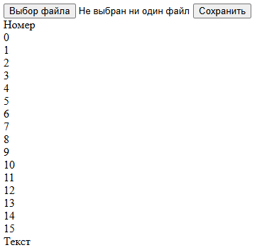
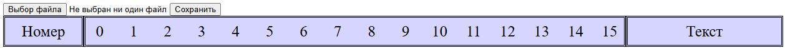

В данной статье рассмотрим создание с 0 простейшего шестнадцатиричного редактора (Hex-редактора) на чистом html, css, javascript. 

Основной задачей этого редактора будет открытие файла любого формата в 16-ричной системе, его редактирование и сохранение изменённого файла.

Рекомендуемый объем загружаемых файлов не более 100 кБайт. Загрузка файлов большего обьема может привести к долгой загрузке и подвисанию сайта.


Начнем создание 16-ричного редактора с создания сайта с html разметкой. Для этого создаем файл с названием index.html и добавляем в него следующий код:


```html
<!DOCTYPE html>
<html>
<head>
  <meta charset="UTF-8">
  <title>16-ричный редактор</title>
  <link rel="stylesheet" href="style.css">
</head>
<body>
  <input type="file" id="myFile">
  <button id="save">Сохранить</button>
  <div id="output" class="output">
     <div class="horizontal">
        <div class="Number">Номер</div>
        <div class="HexDann">
           <div class="infoNumber">0</div>
           <div class="infoNumber">1</div>
           <div class="infoNumber">2</div>
           <div class="infoNumber">3</div>
           <div class="infoNumber">4</div>
           <div class="infoNumber">5</div>
           <div class="infoNumber">6</div>
           <div class="infoNumber">7</div>

           <div class="infoNumber">8</div>
           <div class="infoNumber">9</div>
           <div class="infoNumber">10</div>
           <div class="infoNumber">11</div>
           <div class="infoNumber">12</div>
           <div class="infoNumber">13</div>
           <div class="infoNumber">14</div>
           <div class="infoNumber">15</div>
        </div>
        <div class="TextDann">Текст</div>
     </div>
     <div id="outputDann" class="outputDann">
        <!-- Тут добавляются новые элементы -->
     </div>
  </div>
</body>
<script src="program.js"></script>
</html>
```

Рассмотрим что представляет из себя данный код:

``` <html></html>  ```  все что находится внутри этого тега является сайтом

``` <head></head> ``` Паспорт сайта. Внутри находится то что браузер и поисковики читают в первую очередь, но обычный посетитель на самой странице этого не видит. Внутри следующее:

С помощью тега ``` <meta charset="UTF-8"> ``` указываем браузеру, что веб-страница использует универсальную кодировку символов UTF-8.

С помощью тега ``` <title>16-ричный редактор</title> ``` указываем название сайта "16-ричный редактор"

С помощью тега ``` <link rel="stylesheet" href="style.css"> ``` подключаем файл со стилями style.css находящийся в той же папке что и index.html


``` <body></body> ``` Тело сайта. Внутри находится что видит пользователь.


Первым этапом для создания любого техстового редактора является загрузка файла с компьютера.

Для этого добавим тег ``` <input type="file" id="myFile"> ``` который добавляет окно с вводом данных на сайт. Параметр ``` type="file" ``` говорит о том что загружать мы будем именно файл, а параметр ``` id="myFile" ``` нужен для того чтобы можно было открыть файл с помощью кода на javascript.

Далее добавим тег ``` <button id="save">Сохранить</button> ``` который создаст кнопку при нажатии на которую отредактированный файл должен будет сохраниться.

После этого необходимо создать место где будет выводится на экран информация из файла в 16-ричной системе. для этого создадим несколько ``` <div></div> ```

В результате после запуска файла index.html должно получиться следующее:



Теперь когда основная разметка готова необходимо добавить стили к существующим элементам. Для этого создадим в той же папке новый файл с названием style.css и добавим в него следующий код:


```css
/*Стили для текстового поля в центре. Элементы с классом "inputDann" и "inputDannText" будут генерироваться в javascript*/
.inputDann{
   height: 45px;
   width: 45px;
   text-align: center;
   font-size: 25px;
}
.inputDannText{
   height: 45px;
   width: 100%;
   font-size: 25px;
}
.infoNumber{   
   height: 45px;
   width: 45px;
   font-size: 25px;
   display: flex;
   align-items: center;
   justify-content: center;
}

/*Основные стили сайта*/
.output{
   background: #d5d5ff;
   width: 1250px;
   font-size: 25px;
   display: flex;
   flex-direction: column;
}
.outputDann{
   display: flex;
   flex-direction: column;
}
.horizontal{
   display: flex;
   flex-direction: row;
}

/*Стили для окон в которые будет выводиться информация из файла*/
.Number{
   width: 10%;
   display: flex;
   justify-content: center;
   align-items: center;
   border: double;
}
.TextDann{
   width: 20%;
   display: flex;
   justify-content: center;
   align-items: center;
   border: double;
}
.HexDann{
   width: 70%;
   height: 100%;
   display: flex;
   justify-content: flex-start;
   gap: 1.1%;
   align-items: center;
   border: double;
}
```

Теперь если запустить файл index.html должно получиться следующее:




