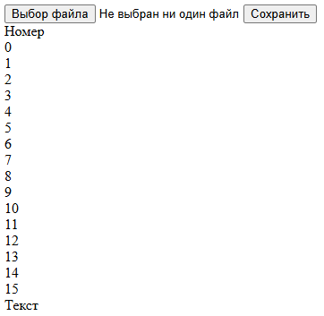
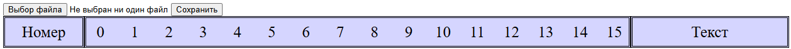
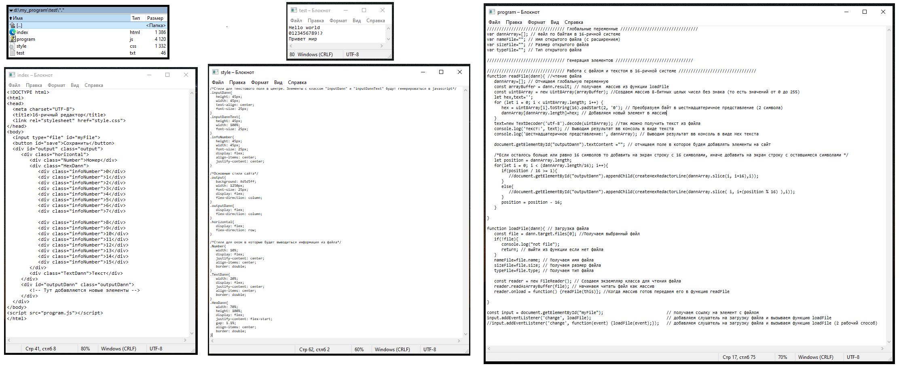
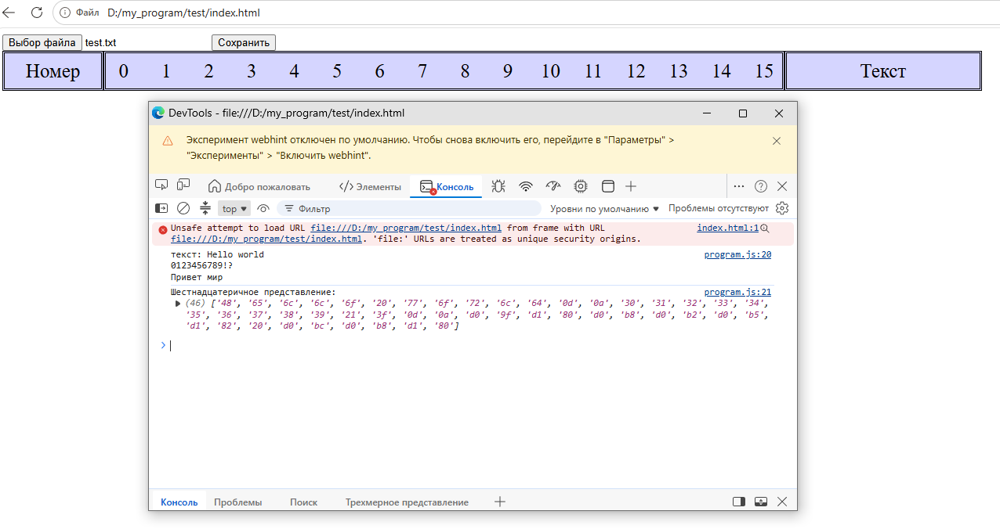
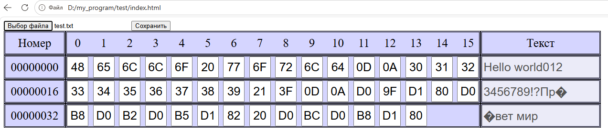

В данной статье рассмотрим создание с 0 простейшего шестнадцатиричного редактора (Hex-редактора) на чистом html, css, javascript. 

Основной задачей этого редактора будет открытие файла любого формата в 16-ричной системе, его редактирование и сохранение изменённого файла.

Рекомендуемый объем загружаемых файлов не более 100 кБайт. Загрузка файлов большего обьема может привести к долгой загрузке и подвисанию сайта.


Начнем создание 16-ричного редактора с создания сайта с html разметкой. Для этого создаем файл с названием index.html и добавляем в него следующий код:


```html
<!DOCTYPE html>
<html>
<head>
  <meta charset="UTF-8">
  <title>16-ричный редактор</title>
  <link rel="stylesheet" href="style.css">
</head>
<body>
  <input type="file" id="myFile">
  <button id="save">Сохранить</button>
  <div id="output" class="output">
     <div class="horizontal">
        <div class="Number">Номер</div>
        <div class="HexDann">
           <div class="infoNumber">0</div>
           <div class="infoNumber">1</div>
           <div class="infoNumber">2</div>
           <div class="infoNumber">3</div>
           <div class="infoNumber">4</div>
           <div class="infoNumber">5</div>
           <div class="infoNumber">6</div>
           <div class="infoNumber">7</div>

           <div class="infoNumber">8</div>
           <div class="infoNumber">9</div>
           <div class="infoNumber">10</div>
           <div class="infoNumber">11</div>
           <div class="infoNumber">12</div>
           <div class="infoNumber">13</div>
           <div class="infoNumber">14</div>
           <div class="infoNumber">15</div>
        </div>
        <div class="TextDann">Текст</div>
     </div>
     <div id="outputDann" class="outputDann">
        <!-- Тут добавляются новые элементы -->
     </div>
  </div>
</body>
<script src="program.js"></script>
</html>
```

Рассмотрим что представляет из себя данный код:

``` <html></html>  ```  все что находится внутри этого тега является сайтом

``` <head></head> ``` Паспорт сайта. Внутри находится то что браузер и поисковики читают в первую очередь, но обычный посетитель на самой странице этого не видит. Внутри следующее:

С помощью тега ``` <meta charset="UTF-8"> ``` указываем браузеру, что веб-страница использует универсальную кодировку символов UTF-8.

С помощью тега ``` <title>16-ричный редактор</title> ``` указываем название сайта "16-ричный редактор"

С помощью тега ``` <link rel="stylesheet" href="style.css"> ``` подключаем файл со стилями style.css находящийся в той же папке что и index.html


``` <body></body> ``` Тело сайта. Внутри находится что видит пользователь.


Первым этапом для создания любого техстового редактора является загрузка файла с компьютера.

Для этого добавим тег ``` <input type="file" id="myFile"> ``` который добавляет окно с вводом данных на сайт. Параметр ``` type="file" ``` говорит о том что загружать мы будем именно файл, а параметр ``` id="myFile" ``` нужен для того чтобы можно было открыть файл с помощью кода на javascript.

Далее добавим тег ``` <button id="save">Сохранить</button> ``` который создаст кнопку при нажатии на которую отредактированный файл должен будет сохраниться.

После этого необходимо создать место где будет выводится на экран информация из файла в 16-ричной системе. для этого создадим несколько ``` <div></div> ```

В результате после запуска файла index.html должно получиться следующее:



Теперь когда основная разметка готова необходимо добавить стили к существующим элементам. Для этого создадим в той же папке новый файл с названием style.css и добавим в него следующий код:


```css
/*Стили для текстового поля в центре. Элементы с классом "inputDann" и "inputDannText" будут генерироваться в javascript*/
.inputDann{
   height: 45px;
   width: 45px;
   box-sizing: border-box;
   text-align: center;
   font-size: 25px;
}
.inputDannText{
   height: 45px;
   box-sizing: border-box;
   width: 100%;
   font-size: 25px;
}
.infoNumber{   
   height: 45px;
   width: 45px;
   box-sizing: border-box;
   font-size: 25px;
   display: flex;
   align-items: center;
   justify-content: center;
}

/*Основные стили сайта*/
.output{
   background: #d5d5ff;
   width: 1250px;
   font-size: 25px;
   display: flex;
   flex-direction: column;
}
.outputDann{
   display: flex;
   flex-direction: column;
}
.horizontal{
   display: flex;
   flex-direction: row;
}

/*Стили для окон в которые будет выводиться информация из файла*/
.Number{
   width: 10%;
   display: flex;
   justify-content: center;
   align-items: center;
   border: double;
}
.TextDann{
   width: 20%;
   display: flex;
   justify-content: center;
   align-items: center;
   border: double;
}
.HexDann{
   width: 70%;
   height: 100%;
   display: flex;
   justify-content: flex-start;
   gap: 1.1%;
   align-items: center;
   border: double;
}
```

Теперь если запустить файл index.html должно получиться следующее:




Осталось добавить код на javascript для работы данного 16-ричного редактора. Для этого в той же папке создадим файл program.js


Для начала определим структуру программы и основные (глобальные) переменные. Первое что нужно сделать это собрать информацию об открытом файле и сохранить текст файла в виде массива, состоящего из байтов в виде 16-ричного кода. Далее потребуется написать функции для генерации новых html элементов и функции для работы с загружаемыми файлами.

```javascript
//////////////////////////////// Глобальные переменные ////////////////////////////////
var dannArray=[]; // Файл по байтам в 16-ричной системе
var nameFile=""; // Имя открытого файла (с расширением)
var sizeFile=""; // Размер открытого файла
var typeFile=""; // Тип открытого файла

//////////////////////////////// Генерация элементов ////////////////////////////////

//////////////////////////////// Работа с файлом и текстом в 16-ричной системе ////////////////////////////////
```

Первым этапом будет загрузка файла с компьютера. Для этого необходимо получить ссылку на html элемент с файлом и добавить на него слушатель, который вызовет функцию (назовем её loadFile(dann)) при загрузки файла.
Сделать это можно с помощью следующего кода:

```javascript
const input = document.getElementById("myFile");                          // получаем ссылку на элемент с файлом
input.addEventListener('change', loadFile);                               // добавляем слушатель на загрузку файла и вызываем функцию loadFile
//input.addEventListener('change', function(event) {loadFile(event);});   // добавляем слушатель на загрузку файла и вызываем функцию loadFile (2 рабочий способ)
```

Так как файл загружается не сразу а постепенно необходимо разбить функцию загрузки файла на 2 функции одна из которых (loadFile(dann)) получает имя, размер и тип выбранного файла dann и сохраняет их в глобальные переменные. 

Далее она открывает этот файл как массив символов и ждет когда он загрузится. После полной загрузки вызывается функция (назовем её readFile(dann)) Задачей которой является перевести полученный массив символов dann
в шестнадцатеричный код, сохранить его в глобальную переменную массив ```dannArray```, и вызвать функцию для отображения символов и текста на экран. Для этого добавим следующий код:

```javascript
//////////////////////////////// Работа с файлом и текстом в 16-ричной системе ////////////////////////////////
function readFile(dann){ //чтение файла
   dannArray=[]; // Отчищаем глобальную переменную
   const arrayBuffer = dann.result; // получаем  массив из функции loadFile
   const uint8Array = new Uint8Array(arrayBuffer); //Создаем массив 8-битных целых чисел без знака (то есть значений от 0 до 255)
   let hex,text='';
   for (let i = 0; i < uint8Array.length; i++) {
      hex = uint8Array[i].toString(16).padStart(2, '0'); // Преобразуем байт в шестнадцатеричное представление (2 символа)
      dannArray[dannArray.length]=hex; // Добавляем новый элемент в массив
   }
   text=new TextDecoder('utf-8').decode(uint8Array); //так можно получить текст из файла
   console.log('текст:', text); // Выводим результат в консоль в виде текста
   console.log('Шестнадцатеричное представление:', dannArray); // Выводим результат в консоль в виде Hex текста

   document.getElementById("outputDann").textContent =""; // отчищаем поле в которое будем добавлять элементы на сайт

   /*Если осталось больше или равно 16 символов то добавить на экран строку с 16 символами, иначе добавить на экран строку с оставшимися символами */ 
   let position = dannArray.length;
   for(let i = 0; i < (dannArray.length/16); i++){
      if(position / 16 >= 1){
         //document.getElementById("outputDann").appendChild(createHexRedactorLine(dannArray.slice(i, i+16),i)); 
      }
      else{
         //document.getElementById("outputDann").appendChild(createHexRedactorLine(dannArray.slice( i, i+(position % 16) ),i));
      }
      position = position - 16;
   }

}

function loadFile(dann){ // Загрузка файла
   const file = dann.target.files[0]; //Получаем выбранный файл
   if(!file){
      console.log("not file");
      return; // выйти из функции если нет файла
   } 
   nameFile=file.name; // Получаем имя файла
   sizeFile=file.size; // Получаем размер файла
   typeFile=file.type; // Получаем тип файла
   
   const reader = new FileReader(); // Создаем экземпляр класса для чтения файла
   reader.readAsArrayBuffer(file); // Начинаем читать файл как массив
   reader.onload = function() {readFile(this)}; //Когда массив готов передаем его в функцию readFile
   
}
```

Строка ```//document.getElementById("outputDann").appendChild(createHexRedactorLine(dannArray.slice( i, i+(position % 16) ),i));``` временно закомментирована до написания функции ```createHexRedactorLine(lengthLine,number)``` в которую подается массив из 1-16 элементов (переменная lengthLine) и позиция этих элементов. Именно в этой функции будут генерироваться окна для вывода на экран пользователя.

На данном этапе код из функций readFile(dann) и loadFile(dann) позволяет открыть почти любой файл, содержащий английские, русские и специальные символы. Проверим работоспособность кода на тестовом файле. Для этого создаем файл test.txt и пишем в него разные символы. Далее открываем его с помощью написанного сайта. На сайте открываем консоль разработчика и смотрим что выдает console.log(). Результат представлен на рисунке:



Рисунок - Исходные данные



Рисунок - Результат работы js кода


Как видно по рисункам данные правильно загружаются.

Теперь необходимо написать функцию ```createHexRedactorLine(lengthLine,number)``` которая будет создавать и возвращать объект с сеткой для ввода данных в 16-ричной системе на экране пользователя. Для этого добавим следующий код:

```javascript
function createHexRedactorLine(lengthLine,number){ //сгенерировать линию для 16-ричного редактора с lengthLine байтами
   const panel=document.createElement('div'); // Создать новый див элемент куда будут помещаться остальные элементы
   panel.className="horizontal"; // Установить имя класса
   const pRight=document.createElement('div'); // Создать новый див элемент куда будет помещаться информация в виде текста (правая панель)
   pRight.className="TextDann"; // Установить имя класса
   const pCenter=document.createElement('div'); // Создать новый див элемент куда будет помещаться информация в виде 16-ричного кода (средняя панель)
   pCenter.className="HexDann"; // Установить имя класса
   const pLeft=document.createElement('div'); // Создать новый див элемент где будет написана позиция элемента (левая панель)
   pLeft.className="Number"; // Установить имя класса
   pLeft.innerHTML = (number*16).toString().padStart(8, '0'); // В левую панель написать позицию элемента с учётом 8 символов

   const inputText=document.createElement('input');  // Создаем поле для отображения текста целиком
   inputText.disabled = true; // Запрещаем редактировать данное поле, так как его редактирование может привести к искажению при переводе на 16-ричную систему
   inputText.className="inputDannText"; // Установить имя класса
   inputText.setAttribute("numstart", number*16 ); // Установить атрибут, отвечающий за начальную позицию этого элемента
   inputText.setAttribute("numend", number*16+lengthLine.length ); // Установить атрибут, отвечающий за конечную позицию этого элемента
   pRight.appendChild(inputText); // Добавляем созданное поле на правую панель

   // В зависимости от размера массива создаем поля для ввода данных в 16-ричном формате
   if(lengthLine.length <= 16){
      for(let i = 0; i < lengthLine.length; i++){
         const input = document.createElement('input'); // Создаем поле для отображения 1 байта в 16-ричном формате (от 00 до FF)
         input.className="inputDann"; // Установить имя класса
         input.setAttribute('num', i+(number*16) ); // Установить атрибут, отвечающий за точную позицию этого элемента (порядковый номер)
         input.gotoInputText = inputText; // Передать переменную отвечающую за поле для отображения текста целиком
         input.addEventListener('keypress', isHexInputDann); // Добавить слушатель, срабатывающий при нажатии клавиши
         input.addEventListener('input', isHexInputDannReplase); // Добавить слушатель, срабатывающий при любом изменении значения поля
         input.value = dannArray[i+(number*16)].toUpperCase(); // Добавить текст из загруженного файла 
         pCenter.appendChild(input); // Добавляем созданное поле на среднюю панель 
      }
      updateInputTextElement(inputText); // Вызываем функцию для обновления поля в правой панели
   }
   panel.appendChild(pLeft); // Добавляем левую панель в главный "div" элемент
   panel.appendChild(pCenter); // Добавляем среднюю панель в главный "div" элемент
   panel.appendChild(pRight); // Добавляем правую панель в главный "div" элемент
   return panel; // Возвращаем главный "div" элемент
}

```

Теперь для того чтобы данный код работал необходимо реализовать 3 функции ```updateInputTextElement(element)```, ```isHexInputDann(input)``` и ```isHexInputDannReplase(input)```, которые отвечают за обновление текстового поля в правой панели и глобальной переменной ```dannArray```. Начнем с функции ```updateInputTextElement(element)``` задачей которой является взять часть 16-ричного массива из глобальной переменной ```dannArray```, перевести его в текст и вывести этот текст на экран в правую панель в созданное заранее поле ```inputText```. Для этого добавим следующий код:

```javascript
//////////////////////////////// Генерация элементов ////////////////////////////////
function updateInputTextElement(element){
   hexArray = dannArray.slice(element.getAttribute("numstart"),element.getAttribute("numend")); //берем часть массива dannArray согласно атрибутам начальной и конечной позиции
   const byteArray = []; // Создаем пустой массив в который будем записывать коды символов
   let decimalValue; // создаем переменную, хранящую общий код символа (1 или 2 байта)
   for (let i = 0; i < hexArray.length; i++) {
      decimalValue = parseInt(hexArray[i], 16); // Преобразование из 16-ричной системы в 10-ричную
      byteArray.push(decimalValue); //добавляем новый элемент в массив
   }
   // Создаём Uint8Array и декодируем как UTF‑8
   const uint8Array = new Uint8Array(byteArray); 
   const decoder = new TextDecoder('utf-8');
   const resultText = decoder.decode(uint8Array);

   element.value = resultText; // Записываем полученный текст на экран пользователя
}

// Далее будут написаны следующие функции
function isHexInputDann(input){} 
function isHexInputDannReplase(input){}

```

Теперь для проверки кода необходимо раскомментировать следующий код из функции ```function readFile(dann){ //чтение файла```.:
```javascript
for(let i = 0; i < (dannArray.length/16); i++){
      if(position / 16 >= 1){
         document.getElementById("outputDann").appendChild(createHexRedactorLine(dannArray.slice(i, i+16),i)); 
      }
      else{
         document.getElementById("outputDann").appendChild(createHexRedactorLine(dannArray.slice( i, i+(position % 16) ),i));
      }
      position = position - 16;
}
```
Далее запускаем сайт и пробуем открыть файл ```test.txt```. В результате должно получиться следующее:



Как видно из рисунка редактор полностью работает, все данные загружаются, данные из средней панели можно редактировать, а данные из правой и левой панели редактировать нельзя. Единственное исключение возникает в предложении "Привет мир". Как видно первую букву "и" преобразовать в текст не удается. Это происходит из-за того что русские символы занимают 2 байта вместо одного а функция ```updateInputTextElement(element)``` берет ограниченное число байт (в соответствии с длиной строки). В результате вместо того чтобы преобразовывать ```D0B8->и```, как это происходит во втором случае (слово "мир"), происходит 2 преобразования ```D0->�``` и ```B8->�```. Именно поэтому при генерации текстового поля с помощью ```inputText.disabled = true;``` было запрещено его редактировать.

Далее напишем функции, срабатывающие при вводе информации в среднюю панель:

```javascript
function isHexInputDann(input){ // При нажатии клавиши
   const char = input.key.toUpperCase(); // Берем заглавный нажатый символ
   this.value = this.value.toUpperCase(); // У текущего значения поля делаем все буквы заглавными
   if (!/[0-9A-FФИСВУАфисвуа]/.test(char)) { // Если символ не 0123456789ABCDEFФИСВУАфисвуа то не пишем его
      input.preventDefault(); // Блокируем ввод недопустимого символа
   }
}
function isHexInputDannReplase(input){ // При изменении текста
   let cursorPosition = this.selectionStart; //сохранить текущее положение курсора
   // Заменяем все допустимые русские буквы на английские
   this.value = this.value.toUpperCase().replace('Ф','A');
   this.value = this.value.toUpperCase().replace('И','B');
   this.value = this.value.toUpperCase().replace('С','C');
   this.value = this.value.toUpperCase().replace('В','D');
   this.value = this.value.toUpperCase().replace('У','E');
   this.value = this.value.toUpperCase().replace('А','F');
   this.value = this.value.toUpperCase().replace(/[^0-9A-FФИСВУАфисвуа]/g, '0'); // русско-английская клавиатура и замена на 0 других символов

   if (this.value.length > 2) { // не больше 2 символов
      this.value = this.value.slice(0, 2); // если введено больше 2 символов то взять только первые 2
   }
   if(this.value.length != 2){
      this.style.color="#ff0000";  // если введено не 2 символа то поменять цвет на красный (ошибка)
   }
   else{
      this.style.color="#000000"; // если введено 2 символа то поменять цвет на черный (все правильно)
      dannArray[this.getAttribute("num")]= this.value; // Сохранить новый байт в глобальную переменную по порядковому номеру
   }
   this.setSelectionRange(cursorPosition,cursorPosition); // Вернуть положение курсора 

   if(cursorPosition == 2){ //если курсор после 2 символа перейти на следующую ячейку
      const element = document.querySelectorAll(".inputDann"); // получить массив со всеми ячейками ввода
      for(let i = 0 ; i < element.length-1; i++){
         if (i == this.getAttribute("num")) { // поиск текущего положения по порядковому номеру
            element[i+1].focus(); // установить фокус на следующий элемент
            element[i+1].setSelectionRange(0,0); // установить фокус в начало
         }
      }
   }
   updateInputTextElement(this.gotoInputText); // Обновить текстовое поле в правой панели
}
```

Таким образом реализован правильный ввод информации в 16-ричном режиме с учётом раскладки клавиатуры, перемещением фокуса между ячейками, ограничением в 2 символа и обновлением информации в глобальной переменной и правой панели. 

Осталось реализовать функцию сохранения полученного массива обратно в файл на компьютер. Для этого напишем следующий код:

```javascript
function writeToFile() { //Сохранение в файл бинарного кода из глобальной переменной dannArray
   const byteArray = []; // Создаем пустой массив
   let decimalValue; // создаем переменную, хранящую общий код символа (1 или 2 байта)
   for (let i = 0; i < dannArray.length; i++) {
      decimalValue = parseInt(dannArray[i], 16); // Преобразование из 16-ричной системы в 10-ричную
      byteArray.push(decimalValue); //добавляем новый элемент в массив
   }
   const uint8Array = new Uint8Array(byteArray); // Создаём Uint8Array и декодируем как UTF‑8

   const blob = new Blob([uint8Array], { type: typeFile }); // Создаём Blob с массивом uint8Array и указанным типом
   const url = URL.createObjectURL(blob); // Создаём URL для этого Blob
   const a = document.createElement('a'); // Создаём элемент <a> для запуска скачивания
   a.href = url;
   a.download = nameFile ; // Указываем имя файла
   document.body.appendChild(a); // Добавляем ссылку в DOM
   a.click(); // имитируем клик 
   document.body.removeChild(a); // Удаляем ссылку в DOM
   URL.revokeObjectURL(url); // Удаляем URL для этого Blob
}
```
Данная функция вызывает стандартный загрузчик браузера, который по умолчанию загружает полученный бинарный файл в папку загрузки. Далее подключаем данную функцию к кнопке с помощью
```javascript
const buttonSawe = document.getElementById("save");                       // получаем ссылку на элемент с кнопкой
buttonSawe.addEventListener('click', writeToFile);                        // добавляем слушатель на сохранение файла и вызываем функцию writeToFile
```
Таким образом полный код файла program.js:

```javascript
//////////////////////////////// Глобальные переменные ////////////////////////////////
var dannArray=[]; // Файл по байтам в 16-ричной системе
var nameFile=""; // Имя открытого файла (с расширением)
var sizeFile=""; // Размер открытого файла
var typeFile=""; // Тип открытого файла

//////////////////////////////// Генерация элементов ////////////////////////////////

function createHexRedactorLine(lengthLine,number){ //сгенерировать линию для 16-ричного редактора с lengthLine байтами
   const panel=document.createElement('div'); // Создать новый див элемент куда будут помещаться остальные элементы
   panel.className="horizontal"; // Установить имя класса
   const pRight=document.createElement('div'); // Создать новый див элемент куда будет помещаться информация в виде текста (правая панель)
   pRight.className="TextDann"; // Установить имя класса
   const pCenter=document.createElement('div'); // Создать новый див элемент куда будет помещаться информация в виде 16-ричного кода (средняя панель)
   pCenter.className="HexDann"; // Установить имя класса
   const pLeft=document.createElement('div'); // Создать новый див элемент где будет написана позиция элемента (левая панель)
   pLeft.className="Number"; // Установить имя класса
   pLeft.innerHTML = (number*16).toString().padStart(8, '0'); // В левую панель написать позицию элемента с учётом 8 символов

   const inputText=document.createElement('input');  // Создаем поле для отображения текста целиком
   inputText.disabled = true; // Запрещаем редактировать данное поле, так как его редактирование может привести к искажению при переводе на 16-ричную систему
   inputText.className="inputDannText"; // Установить имя класса
   inputText.setAttribute("numstart", number*16 ); // Установить атрибут, отвечающий за начальную позицию этого элемента
   inputText.setAttribute("numend", number*16+lengthLine.length ); // Установить атрибут, отвечающий за конечную позицию этого элемента
   pRight.appendChild(inputText); // Добавляем созданное поле на правую панель

   // В зависимости от размера массива создаем поля для ввода данных в 16-ричном формате
   if(lengthLine.length <= 16){
      for(let i = 0; i < lengthLine.length; i++){
         const input = document.createElement('input'); // Создаем поле для отображения 1 байта в 16-ричном формате (от 00 до FF)
         input.className="inputDann"; // Установить имя класса
         input.setAttribute('num', i+(number*16) ); // Установить атрибут, отвечающий за точную позицию этого элемента (порядковый номер)
         input.gotoInputText = inputText; // Передать переменную отвечающую за поле для отображения текста целиком
         input.addEventListener('keypress', isHexInputDann); // Добавить слушатель, срабатывающий при нажатии клавиши
         input.addEventListener('input', isHexInputDannReplase); // Добавить слушатель, срабатывающий при любом изменении значения поля
         input.value = dannArray[i+(number*16)].toUpperCase(); // Добавить текст из загруженного файла 
         pCenter.appendChild(input); // Добавляем созданное поле на среднюю панель 
      }
      updateInputTextElement(inputText); // Вызываем функцию для обновления поля в правой панели
   }
   panel.appendChild(pLeft); // Добавляем левую панель в главный "div" элемент
   panel.appendChild(pCenter); // Добавляем среднюю панель в главный "div" элемент
   panel.appendChild(pRight); // Добавляем правую панель в главный "div" элемент
   return panel; // Возвращаем главный "div" элемент
}

function updateInputTextElement(element){ // Обновить поле в правой панели
   hexArray = dannArray.slice(element.getAttribute("numstart"),element.getAttribute("numend")); //берем часть массива dannArray согласно атрибутам начальной и конечной позиции
   const byteArray = []; // Создаем пустой массив в который будем записывать коды символов
   let decimalValue; // создаем переменную, хранящую общий код символа (1 или 2 байта)
   for (let i = 0; i < hexArray.length; i++) {
      decimalValue = parseInt(hexArray[i], 16); //Преобразование из 16-ричной системы в 10-ричную
      byteArray.push(decimalValue); //добавляем новый элемент в массив
   }
   // Создаём Uint8Array и декодируем как UTF‑8
   const uint8Array = new Uint8Array(byteArray); 
   const decoder = new TextDecoder('utf-8');
   const resultText = decoder.decode(uint8Array);

   element.value = resultText; // Записываем полученный текст на экран пользователя
}

function isHexInputDann(input){ // При нажатии клавиши
   const char = input.key.toUpperCase(); // Берем заглавный нажатый символ
   this.value = this.value.toUpperCase(); // У текущего значения поля делаем все буквы заглавными
   if (!/[0-9A-FФИСВУАфисвуа]/.test(char)) { // Если символ не 0123456789ABCDEFФИСВУАфисвуа то не пишем его
      input.preventDefault(); // Блокируем ввод недопустимого символа
   }
}
function isHexInputDannReplase(input){ // При изменении текста
   let cursorPosition = this.selectionStart; //сохранить текущее положение курсора
   // Заменяем все допустимые русские буквы на английские
   this.value = this.value.toUpperCase().replace('Ф','A');
   this.value = this.value.toUpperCase().replace('И','B');
   this.value = this.value.toUpperCase().replace('С','C');
   this.value = this.value.toUpperCase().replace('В','D');
   this.value = this.value.toUpperCase().replace('У','E');
   this.value = this.value.toUpperCase().replace('А','F');
   this.value = this.value.toUpperCase().replace(/[^0-9A-FФИСВУАфисвуа]/g, '0'); // русско-английская клавиатура и замена на 0 других символов

   if (this.value.length > 2) { // не больше 2 символов
      this.value = this.value.slice(0, 2); // если введено больше 2 символов то взять только первые 2
   }
   if(this.value.length != 2){
      this.style.color="#ff0000";  // если введено не 2 символа то поменять цвет на красный (ошибка)
   }
   else{
      this.style.color="#000000"; // если введено 2 символа то поменять цвет на черный (все правильно)
      dannArray[this.getAttribute("num")]= this.value; // Сохранить новый байт в глобальную переменную по порядковому номеру
   }
   this.setSelectionRange(cursorPosition,cursorPosition); // Вернуть положение курсора 

   if(cursorPosition == 2){ //если курсор после 2 символа перейти на следующую ячейку
      const element = document.querySelectorAll(".inputDann"); // получить массив со всеми ячейками ввода
      for(let i = 0 ; i < element.length-1; i++){
         if (i == this.getAttribute("num")) { // поиск текущего положения по порядковому номеру
            element[i+1].focus(); // установить фокус на следующий элемент
            element[i+1].setSelectionRange(0,0); // установить фокус в начало
         }
      }
   }
   updateInputTextElement(this.gotoInputText); // Обновить текстовое поле в правой панели
}

//////////////////////////////// Работа с файлом и текстом в 16-ричной системе ////////////////////////////////
function readFile(dann){ //чтение файла
   dannArray=[]; // Отчищаем глобальную переменную
   const arrayBuffer = dann.result; // получаем  массив из функции loadFile
   const uint8Array = new Uint8Array(arrayBuffer); //Создаем массив 8-битных целых чисел без знака (то есть значений от 0 до 255)
   let hex,text='';
   for (let i = 0; i < uint8Array.length; i++) {
      hex = uint8Array[i].toString(16).padStart(2, '0'); // Преобразуем байт в шестнадцатеричное представление (2 символа)
      dannArray[dannArray.length]=hex; // Добавляем новый элемент в массив
   }
   text=new TextDecoder('utf-8').decode(uint8Array); //так можно получить текст из файла
   console.log('текст:', text); // Выводим результат в консоль в виде текста
   console.log('Шестнадцатеричное представление:', dannArray); // Выводим результат в консоль в виде Hex текста

   document.getElementById("outputDann").textContent =""; // отчищаем поле в которое будем добавлять элементы на сайт

   /*Если осталось больше или равно 16 символов то добавить на экран строку с 16 символами, иначе добавить на экран строку с оставшимися символами */ 
   let position = dannArray.length;
   for(let i = 0; i < (dannArray.length/16); i++){
      if(position / 16 >= 1){
         document.getElementById("outputDann").appendChild(createHexRedactorLine(dannArray.slice(i, i+16),i)); 
      }
      else{
         document.getElementById("outputDann").appendChild(createHexRedactorLine(dannArray.slice( i, i+(position % 16) ),i));
      }
      position = position - 16;
   }

}

function loadFile(dann){ // Загрузка файла
   const file = dann.target.files[0]; //Получаем выбранный файл
   if(!file){
      console.log("not file");
      return; // выйти из функции если нет файла
   } 
   nameFile=file.name; // Получаем имя файла
   sizeFile=file.size; // Получаем размер файла
   typeFile=file.type; // Получаем тип файла
   
   const reader = new FileReader(); // Создаем экземпляр класса для чтения файла
   reader.readAsArrayBuffer(file); // Начинаем читать файл как массив
   reader.onload = function() {readFile(this)}; //Когда массив готов передаем его в функцию readFile
 
}

function writeToFile() { //Сохранение в файл бинарного кода из глобальной переменной dannArray
   const byteArray = []; // Создаем пустой массив
   let decimalValue; // создаем переменную, хранящую общий код символа (1 или 2 байта)
   for (let i = 0; i < dannArray.length; i++) {
      decimalValue = parseInt(dannArray[i], 16); // Преобразование из 16-ричной системы в 10-ричную
      byteArray.push(decimalValue); //добавляем новый элемент в массив
   }
   const uint8Array = new Uint8Array(byteArray); // Создаём Uint8Array и декодируем как UTF‑8

   const blob = new Blob([uint8Array], { type: typeFile }); // Создаём Blob с массивом uint8Array и указанным типом
   const url = URL.createObjectURL(blob); // Создаём URL для этого Blob
   const a = document.createElement('a'); // Создаём элемент <a> для запуска скачивания
   a.href = url;
   a.download = nameFile ; // Указываем имя файла
   document.body.appendChild(a); // Добавляем ссылку в DOM
   a.click(); // имитируем клик 
   document.body.removeChild(a); // Удаляем ссылку в DOM
   URL.revokeObjectURL(url); // Удаляем URL для этого Blob
}

const input = document.getElementById("myFile");                          // получаем ссылку на элемент с файлом
input.addEventListener('change', loadFile);                               // добавляем слушатель на загрузку файла и вызываем функцию loadFile
//input.addEventListener('change', function(event) {loadFile(event);});   // добавляем слушатель на загрузку файла и вызываем функцию loadFile (2 рабочий способ)
const buttonSawe = document.getElementById("save");                       // получаем ссылку на элемент с кнопкой
buttonSawe.addEventListener('click', writeToFile);                        // добавляем слушатель на сохранение файла и вызываем функцию writeToFile
```

Проверим работу 16-ричного редактора целиком. Для этого создадим картинку, загрузим её в редактор, поменяем пиксели и сохраним новое изображение
